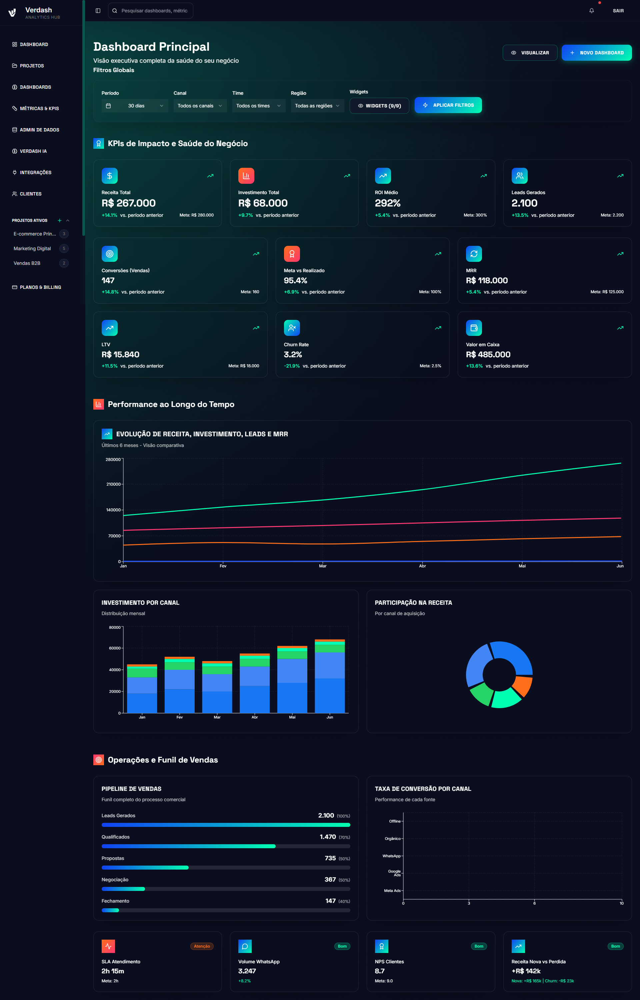
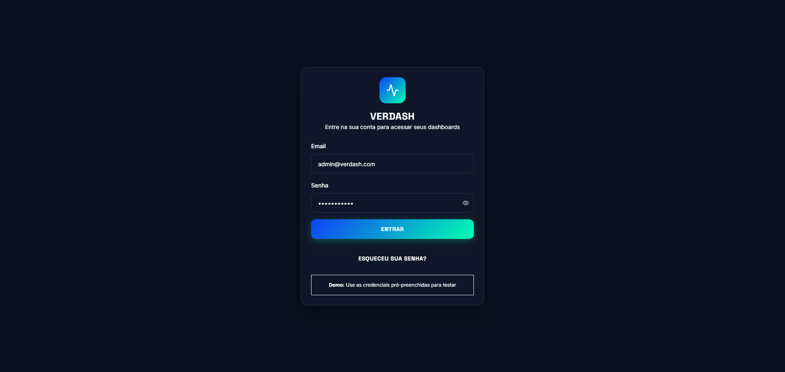

# Verdash — HUB de Dados Inteligente 🚀

[]()
[]()
[]()
[]()

---

## 📝 Descrição

O **Verdash** é um HUB de dados inteligente para empresas, times e agências. Permite criar dashboards, métricas, KPIs, integrar dados de múltiplas fontes e gerar insights de forma visual, simples e colaborativa.

---

## 👤 Autoria

**Product Owner & Estratégia Comercial:**  
:star: **Vitoria Delgado** — Product Owner e responsável pela visão e estruturação comercial do Verdash.

**Idealização, Esboço e Desenvolvimento:**  
:rocket: **Peterson de Lima** — CEO Agência Tektus, idealizador, designer do esboço do sistema e desenvolvedor principal.

---

## 🖼️ Screenshots

### Dashboard Principal


### Tela de Login


### Página de Preços


---

## 🚧 Status

> **Em desenvolvimento** — MVP funcional, novas features em roadmap contínuo.

---

## 🚀 Tecnologias

- ⚛️ React + Vite
- 🦄 Shadcn UI
- 🎨 TailwindCSS
- 🔒 AuthContext (autenticação)
- 📦 TanStack Query
- 🗃️ Supabase (opcional)
- 📊 Recharts

---

## ⚡ Instalação Local

```bash
git clone https://github.com/seu-usuario/verdash.git
cd verdash
npm install
npm run dev
```

---

## 📁 Estrutura de Pastas

```
src/
  components/      # Componentes reutilizáveis
  contexts/        # Contextos globais (ex: Auth)
  pages/           # Páginas principais
  hooks/           # Custom hooks
  lib/             # Funções utilitárias
  styles/          # Estilos globais
  ...
public/
  screenshots/
```

---

## ✨ Funcionalidades

- [x] Gestão de usuários e times
- [x] Criação de projetos e dashboards
- [x] Widgets de KPIs, gráficos e tabelas
- [x] Integração com Google Sheets, CSV, Webhooks
- [x] Sistema de planos e billing
- [x] White label básico
- [ ] API pública (em breve)
- [ ] Relatórios automáticos (em breve)
- [ ] Verdash IA (em breve)

---

## 🗺️ Roadmap

Veja o roadmap completo em [Plano_de_criacao_verdash/Roadmap_da_Verdash_—_HUB_de_Dados_Inteligente.txt](./Plano_de_criacao_verdash/Roadmap_da_Verdash_—_HUB_de_Dados_Inteligente.txt)

### Fases principais:

- 🎯 Fase 1 — MVP Funcional (Lançamento Alpha)
Objetivo: Ter uma plataforma operacional, validando a proposta de valor e uso real.

* ✅ Gestão de usuários (Admin, Time, Cliente)
* ✅ Criação de projetos e dashboards
* ✅ Widgets básicos (KPIs, gráficos, tabelas)
* ✅ Criação de métricas e KPIs compostos
* ✅ Integração com Google Sheets (via API)
* ✅ Entrada de dados via CSV e Webhooks
* ✅ Compartilhamento de dashboards (leitura e interativo)
* ✅ Sistema de billing (Stripe) e controle de planos
* ✅ White label básico (logo, cores, domínio)
* ✅ Logs e histórico de ações
* ✅ Onboarding inicial + Help Center básico

Status: Concluído ou em desenvolvimento imediato.
________________

🔥 Fase 2 — Lançamento Público (Versão Beta)
Objetivo: Escalar aquisição, estruturar suporte e melhorar robustez.

* 🛠️ API pública para entrada e consulta de dados
* 🛠️ Dashboard performance otimizado (filtros avançados, drill down)
* 🛠️ Monitoramento de Webhooks (logs, alertas, falhas)
* 🛠️ Relatórios automáticos (PDF, links agendados)
* 🛠️ Integrações diretas com Meta Ads e Google Ads
* 🛠️ Suporte integrado via chat interno (widget na plataforma)
* 🛠️ Gestão de permissões detalhada por projeto ou dashboard
* 🛠️ Refinamento do modo white label (incluindo URLs dedicadas)
* 🛠️ Onboarding guiado e checklist inteligente para cada plano
* 🛠️ Dashboard mobile responsive
     
Previsão: 2 a 3 meses após MVP estável.
________________

🚀 Fase 3 — Escala e Consolidação (Versão Estável)
Objetivo: Tornar o Verdash referência como HUB de dados acessível.

* 🔗 Integrações via N8N, Zapier e Make (automação no-code)
* 🔗 CRM interno simplificado para gestão de leads e vendas
* 🔗 Integração nativa com WhatsApp (via APIs externas)
* 🔗 Dashboard de comparativos por período e por cliente
* 🔗 Métricas preditivas (Machine Learning Light)
* 🔗 Upgrade do Verdash IA com insights automáticos mais avançados
* 🔗 Módulo de NPS e feedback dos clientes dentro da plataforma
* 🔗 Módulo de gestão financeira simples para os clientes (opcional)
* 🔗 API GraphQL (além do REST) para acesso e manipulação de dados

Previsão: De 4 a 6 meses após lançamento beta.
________________

🏆 Fase 4 — Produto Premium + Internacionalização
Objetivo: Tornar a Verdash uma referência SaaS global.

* 🌍 Multi-idiomas e moeda (iniciar com PT, EN, ES)
* 🌍 Infraestrutura escalável global (AWS + Vercel/Netlify + Supabase Global Edge)
* 🌍 Segurança avançada (SOC2 compliance, backups redundantes, criptografia total)
* 🌍 App mobile (iOS + Android)
* 🌍 SDKs públicos para desenvolvedores (Javascript, Python, PHP)
* 🌍 Marketplace de templates de dashboards, métricas e automações

Previsão: 6 a 12 meses após consolidação da versão estável.
________________


🥇 Fase 5 — Feature Visionária (Categoria de Produto Nova)
Objetivo: Sair da categoria de dashboard comum e entrar no segmento de “Operational Data Hub” + BI simplificado com AI first.

* 🤖 Verdash IA 100% autônoma (detecta anomalias, gera insights e alertas inteligentes)
* 🔥 Módulo de orquestração de dados: arrasta e solta para combinar fontes, regras e saídas (Low-Code/No-Code para dados)
* 🔥 Dashboard preditivo (projeções baseadas em dados + IA)
* 🔥 Visualização interativa tipo Notion (dados como blocos interativos, não só gráficos)
* 🔥 Controle de workflows e processos comerciais dentro do dashboard (Ex.: Kanban de vendas, CRM visual)
* 🔥 Análises conversacionais (chat com IA que responde sobre seus dados, estilo ChatGPT para dados)

Status: Roadmap futuro (Visão 12 a 18 meses).
________________

🗺️ Visual de Roadmap (Organização por Colunas)

| Fase                | Status         | Duração Prevista         | Objetivo                                 |
|---------------------|---------------|-------------------------|------------------------------------------|
| MVP Funcional       | ✔️ Em execução | 1 mês                   | Produto funcional no ar                  |
| Lançamento Beta     | 🔄 Planejado   | +2/3 meses após MVP      | Abertura para público com melhorias      |
| Escala e Consolidação | 🔄 Roadmap    | +4/6 meses após Beta     | Crescimento e robustez                   |
| Internacionalização | 🕓 Roadmap     | +6/12 meses após Estável | Expansão global                          |
| Produto Visionário  | 🔭 Roadmap futuro | 12 a 18 meses         | AI-driven Operational Data Hub           |

---

## 📚 Documentação e Wikis

- [Roadmap do Produto](./Plano_de_criacao_verdash/Roadmap_da_Verdash_—_HUB_de_Dados_Inteligente.txt)
- [Wiki de Integrações](./docs/integracoes.md) <!-- Crie se desejar -->

---

## 🤝 Contribuição

Contribuições são bem-vindas! Abra uma issue, envie um PR ou compartilhe feedbacks.

---

## 📝 Licença

Este projeto está sob a licença MIT. Veja o arquivo [LICENSE](./LICENSE) para mais detalhes.

---

> Feito com 💚 por Peterson de Lima - CEO Agência Tektus
