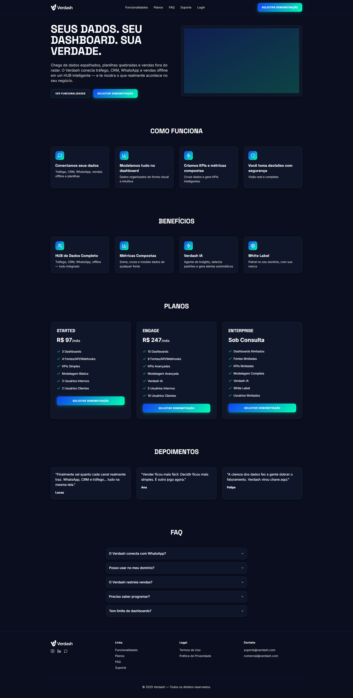

# Verdash — HUB de Dados Inteligente 🚀

[]()
[]()
[]()
[]()

---

## 📝 Descrição

O **Verdash** é um HUB de dados inteligente para empresas, times e agências. Permite criar dashboards, métricas, KPIs, integrar dados de múltiplas fontes e gerar insights de forma visual, simples e colaborativa.

---

## 👤 Autoria

**Product Owner & Estratégia Comercial:**  
:star: **Vitoria Delgado** — Product Owner e responsável pela visão e estruturação comercial do Verdash.

**Idealização, Esboço e Desenvolvimento:**  
:rocket: **Peterson de Lima** — CEO Agência Tektus, idealizador, designer do esboço do sistema e desenvolvedor principal.

---

## 🖼️ Screenshots

### Dashboard Principal


### Tela de Login


### Página de Preços


---

## 🚧 Status

> **Em desenvolvimento** — MVP funcional, novas features em roadmap contínuo.

---

## 🚀 Tecnologias

- ⚛️ React + Vite
- 🦄 Shadcn UI
- 🎨 TailwindCSS
- 🔒 AuthContext (autenticação)
- 📦 TanStack Query
- 🗃️ Supabase (opcional)
- 📊 Recharts

---

## ⚡ Instalação Local

```bash
git clone https://github.com/seu-usuario/verdash.git
cd verdash
npm install
npm run dev
```

**Edit a file directly in GitHub**

- Navigate to the desired file(s).
- Click the "Edit" button (pencil icon) at the top right of the file view.
- Make your changes and commit the changes.

**Use GitHub Codespaces**

- Navigate to the main page of your repository.
- Click on the "Code" button (green button) near the top right.
- Select the "Codespaces" tab.
- Click on "New codespace" to launch a new Codespace environment.
- Edit files directly within the Codespace and commit and push your changes once you're done.

## What technologies are used for this project?

This project is built with:

- Vite
- TypeScript
- React
- shadcn-ui
- Tailwind CSS

## How can I deploy this project?

Simply open [Lovable](https://lovable.dev/projects/0fa42068-f97e-4fce-81e3-7666fc15adb3) and click on Share -> Publish.

## Can I connect a custom domain to my Lovable project?

Yes, you can!

To connect a domain, navigate to Project > Settings > Domains and click Connect Domain.

Read more here: [Setting up a custom domain](https://docs.lovable.dev/tips-tricks/custom-domain#step-by-step-guide)
